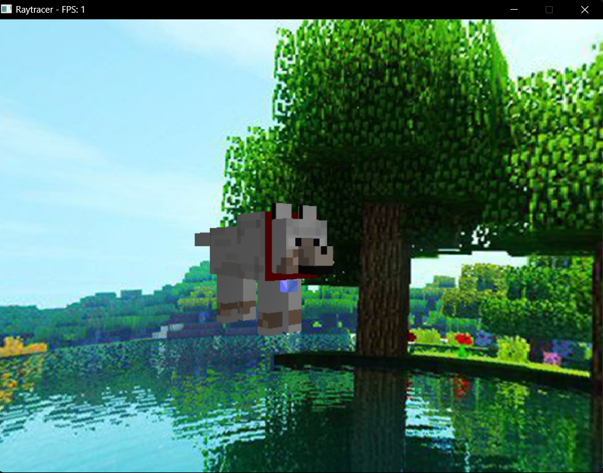

# Proyecto 3 de Gráficas por Computadora ⚡



## Video de demostración 📽️
[](https://www.youtube.com/watch?v=3yK7TMUq8D0)

## Descripción📝
Este proyecto consiste en el desarrollo de un diorama interactivo utilizando técnicas de raytracing. El diorama incluye efectos visuales como albedo, specular, transparencia y reflectividad para lograr una escena compleja y visualmente atractiva. 🔩

## Criterios de Evaluación ❓

- **Complejidad de la Escena (30 puntos):** La puntuación se basará en la complejidad de la escena implementada.✅
- **Atractivo Visual (20 puntos):** La puntuación se otorgará según la apariencia visual general de la escena.✅
- **Rotación y Acercamiento de la Cámara (20 puntos):** Se evaluará la implementación de rotación y la capacidad de acercamiento y alejamiento de la cámara.✅
- **Materiales Diferentes (5 puntos cada uno, máximo 5):** Cada material implementado con su propia textura y parámetros para albedo, specular, transparencia y reflectividad suma 5 puntos.✅
- **Refracción (10 puntos):** Puntuación por la implementación de refracción en al menos uno de los materiales, contextualmente relevante en la escena.✅
- **Reflexión (5 puntos):** Puntuación por la implementación de reflexión en al menos uno de los materiales.✅
- **Skybox (20 puntos):** Se otorgarán puntos por la implementación exitosa de un skybox para los materiales.✅
- 
## Tecnologías Utilizadas 💻
- CLion
- glm
- SDL
- SDL_image
- C++

## Estructura de Archivos 📄
- `camera.cpp`
- `camera.h`
- `color.h`
- `cube.cpp`
- `cube.h`
- `imageLoader.h`
- `intersect.h`
- `light.h`
- `main.cpp`
- `material.h`
- `object.h`
- `print.h`
- `raycaster.h`
- `skybox.cpp`
- `skybox.h`
- `sphere.cpp`
- `sphere.h`

## Configuración del Proyecto ⛓️

Asegúrate de tener instaladas las siguientes bibliotecas:

```bash
# SDL 🚀
# SDL_image 🚀
# glm 🚀
```
# Uso del Código 🕘
1. Clona el repositorio. 🚩
2. Abre el proyecto en CLion. 🚩
3. Compila y ejecuta el código. 🚩

# Contribuciones 💯
Las contribuciones son bienvenidas. Si encuentras algún problema o tienes sugerencias, por favor, abre un problema o envía una solicitud de extracción.

# Licencia 🎮
ℹ️ Este proyecto está bajo la Licencia MIT. 